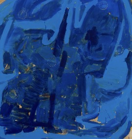

# Headline

*italic*

Observing a situation is a fundamental aspect of artistic practice. It involves closely examining the environment,
context, and interactions within a given space. This process allows artists to gain insights into the dynamics at play,
which can inform their creative decisions and approaches.

